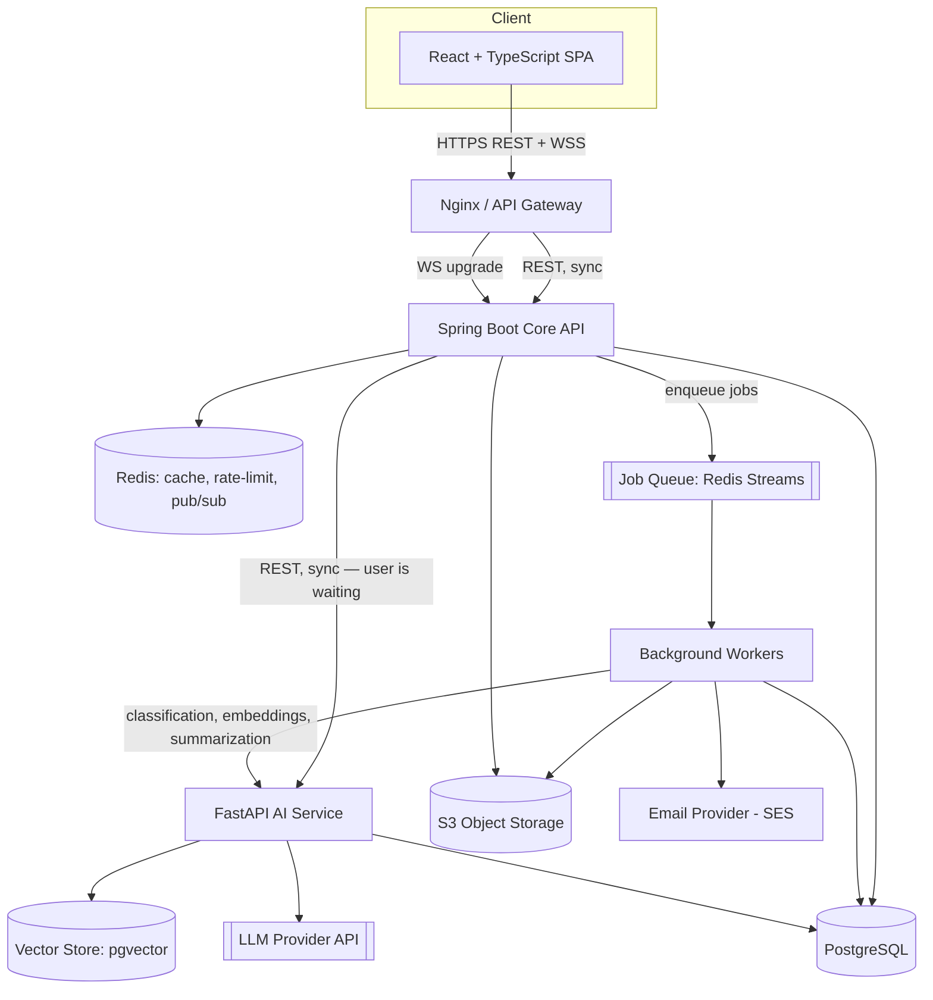
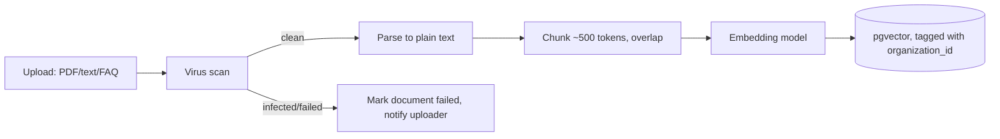
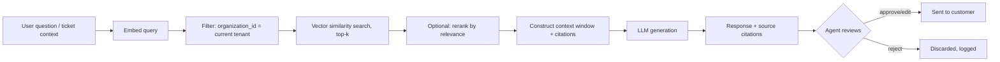
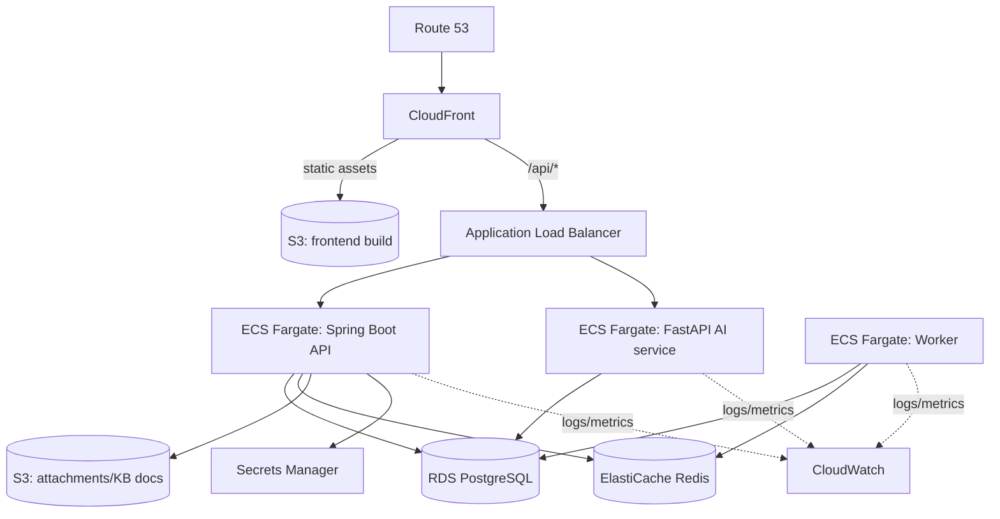
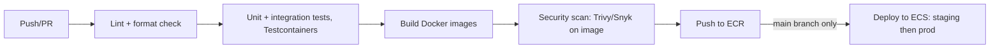

# AI-Powered Multi-Tenant Helpdesk SaaS — Technical Specification

**Purpose:** Flagship freelance portfolio project. Optimized for maximum demonstrated skill per unit of effort, buildable solo, deployable, and genuinely useful as a product — not a tutorial clone.

---

## 1. High-Level Architecture

**Sync vs async at a glance:**
- **Synchronous:** Frontend ↔ API Gateway ↔ Spring Boot API ↔ Postgres/Redis (request/response, must be fast)
- **Synchronous (internal):** Spring Boot → FastAPI AI service, for anything the *user is waiting on* (response suggestion, semantic search)
- **Asynchronous:** Everything that can happen in the background — classification, embeddings, email, SLA checks, analytics rollups — goes through a queue to a worker pool



**Why this shape:** one clear synchronous request path for anything a human is staring at a spinner for, one clear async path for everything else. This single distinction is the thing to explain confidently in an interview — it's the core system-design decision of the whole project.

---

## 2. Service Boundaries: Modular Monolith + One AI Service

**Decision: not microservices.** A single developer running 6+ independently deployed services is a portfolio red flag, not a strength — it signals cargo-culting rather than judgment. The right call:

| Component | Deployment unit | Why |
|---|---|---|
| Spring Boot API | Single deployable, modular internally (`auth`, `tickets`, `orgs`, `kb`, `notifications` as packages/modules) | Core business logic, transactional, needs Postgres consistency |
| FastAPI AI service | Separate deployable | Different language/runtime for LLM/embedding libraries; different scaling profile (CPU/IO bound on external API calls, not DB-bound); isolates a slow/flaky dependency (LLM provider) from the core API's availability |
| Background workers | Same codebase as Spring Boot (separate entrypoint/process), OR a small Python worker for AI-heavy jobs | Reuses domain models; avoids a third language for job orchestration |
| Frontend | Separate deployable (static build, CDN) | Standard SPA separation |

**This gives you two real services (Java + Python) — enough to demonstrate polyglot architecture and inter-service communication — without the operational tax of a true microservices mesh (service discovery, distributed tracing across 8 services, saga orchestration, etc.).** If asked "why not microservices," the honest answer is the strongest one: the team size (one person) doesn't justify the operational overhead, and the monolith's modules are already structured so it *could* be split later — which is itself the mature answer clients want to hear.

---

## 3. Technology Decisions

| Tech | Problem it solves | Why this over alternative | MVP or later? |
|---|---|---|---|
| **Spring Boot** | Core transactional API, RBAC, tenant logic | Mature ecosystem (Spring Security, JPA, validation) — most enterprise clients run Java/Spring, so it's directly relevant | MVP |
| **FastAPI** | AI service — async I/O to LLM/embedding APIs | Python has the LLM/RAG tooling ecosystem; FastAPI's async support fits well with I/O-bound LLM calls | MVP |
| **PostgreSQL** | System of record, relational integrity, tenant data | Battle-tested, supports JSONB for flexible fields, and (critically) **pgvector** lets you skip a separate vector DB for MVP | MVP |
| **Redis** | Cache, rate limiting, pub/sub for WS fanout, job queue | One tool covers four needs cheaply; don't reach for Kafka/RabbitMQ at this scale | MVP |
| **pgvector** (vector store) | Embedding storage/similarity search | Avoids running a second database (Pinecone/Qdrant/Weaviate) for MVP scale; migrate to a dedicated vector DB only if you outgrow it — mention this as a documented future scaling decision | MVP (Qdrant/Pinecone = Advanced, if you want to show you know when to graduate) |
| **Redis Streams** (queue) | Async job processing | Already running Redis; avoids adding RabbitMQ/Kafka just to look impressive. Swap for SQS in the AWS section as the "production" answer | MVP |
| **S3** | File attachments, KB documents | Standard, presigned URLs, lifecycle rules | MVP |
| **Docker + Compose** | Local dev parity, deployment packaging | Non-negotiable for a serious portfolio piece | MVP |
| **Nginx** | Reverse proxy, TLS termination, static frontend serving | Simple, well-understood; ALB can replace it in AWS | MVP |
| **AWS (ECS Fargate, RDS, ElastiCache, S3, CloudFront)** | Deployment | Managed services reduce ops burden so you can point to *architecture decisions* in the interview rather than *server babysitting* | MVP-ish (can start on a single EC2 + Docker Compose, graduate to ECS) |
| **WebSockets** (Spring's native WS or STOMP) | Real-time ticket updates, typing indicators, presence | Necessary for the "real-time" feature to be real | MVP |
| **LLM provider** (Claude/OpenAI via API) | Classification, summarization, response generation | Don't self-host a model — not the point of this project, and adds infra cost/complexity for no portfolio value | MVP |
| **Embedding model** (provider API, e.g. `text-embedding-3-small` or Voyage) | RAG retrieval | Cheap, no infra; self-hosting is Advanced-tier only if you want to show ML-ops chops later | MVP |

**Deliberately excluded from MVP:** Kubernetes (massive overkill for one service pair), Kafka (Redis Streams is enough at this scale), microservices mesh, a dedicated vector DB, GraphQL (REST + WS covers everything needed and is what most clients actually use).

---

## 4. Database Architecture

**Tenant isolation strategy: shared schema, `organization_id` on every tenant-scoped table, enforced at the application layer AND with PostgreSQL Row-Level Security (RLS) as defense-in-depth.**

Why shared schema over schema-per-tenant or DB-per-tenant: at this scale (portfolio/small SaaS), schema-per-tenant multiplies migration complexity for no real benefit, and DB-per-tenant is operationally heavy. Shared schema + RLS is what most real B2B SaaS products actually run until they have compliance reasons (e.g., enterprise data-residency contracts) to do otherwise — and documenting *why* you didn't over-engineer this is a strong interview answer.

**RLS: yes, use it.** Set `app.current_org_id` as a session variable per request (via a connection-pool-aware interceptor), and add policies like:

```sql
ALTER TABLE tickets ENABLE ROW LEVEL SECURITY;
CREATE POLICY tenant_isolation ON tickets
  USING (organization_id = current_setting('app.current_org_id')::uuid);
```

This means even a bug in application-layer filtering can't leak cross-tenant data — the database itself refuses. This is the single highest-value security detail to highlight in the portfolio writeup.

**Core schema (abbreviated — full DDL in implementation phase):**

```
organizations (id, name, slug, plan, created_at)
users (id, email, password_hash, name, email_verified_at, created_at)
memberships (id, user_id FK, organization_id FK, role ENUM[owner,admin,agent,customer], created_at)
  -- composite unique (user_id, organization_id)

tickets (id, organization_id FK, customer_id FK, assigned_agent_id FK NULL,
         subject, status ENUM, priority ENUM, category, sla_policy_id FK NULL,
         created_at, updated_at, resolved_at)
  -- index: (organization_id, status, priority), (organization_id, assigned_agent_id)

ticket_messages (id, ticket_id FK, author_id FK, body, is_internal_note BOOL,
                  is_ai_generated BOOL, created_at)
  -- index: (ticket_id, created_at)

ticket_attachments (id, ticket_message_id FK, s3_key, filename, mime_type, size_bytes, scanned_at, scan_result)

ticket_events (id, ticket_id FK, event_type, actor_id FK NULL, metadata JSONB, created_at)
  -- append-only audit trail per ticket

tags (id, organization_id FK, name)
ticket_tags (ticket_id FK, tag_id FK)

knowledge_base_documents (id, organization_id FK, title, source_type, s3_key NULL,
                            content_hash, status ENUM[processing,ready,failed], created_at)
kb_chunks (id, document_id FK, organization_id FK, chunk_text, embedding VECTOR(1536),
           chunk_index, token_count)
  -- index: organization_id (for pre-filtering before ANN search), ivfflat/hnsw index on embedding

sla_policies (id, organization_id FK, name, first_response_minutes, resolution_minutes, priority ENUM)

ai_classifications (id, ticket_id FK, category, priority_suggestion, sentiment,
                     confidence, model_version, created_at)
ai_generations (id, ticket_id FK NULL, kind ENUM[response_suggestion,summary,insight],
                prompt_hash, output, model, token_count, latency_ms, approved_by FK NULL, created_at)

notifications (id, user_id FK, type, payload JSONB, read_at, created_at)
audit_logs (id, organization_id FK, actor_id FK NULL, action, entity_type, entity_id, metadata JSONB, created_at)
```

**Pagination:** keyset (cursor-based) pagination on `(created_at, id)` for ticket lists and messages — offset pagination degrades badly on large ticket volumes and is the wrong answer in an interview. Return an opaque cursor, not raw offsets.

**Indexing notes:** every tenant-scoped table gets `organization_id` as the leading column in its most common composite index — this is what makes RLS-filtered queries fast rather than just correct.

---

## 5. AI Architecture

This is the section that differentiates the project, so treat it as a first-class system, not a bolt-on.

### 5.1 Ingestion pipeline (knowledge base → vector store)



Chunking strategy: semantic/paragraph-aware chunking with ~10–15% overlap, target 300–500 tokens per chunk — small enough for precise retrieval, large enough to preserve context. Store `document_id` and `organization_id` on every chunk so retrieval can always pre-filter by tenant *before* the similarity search runs, not after.

### 5.2 Retrieval + generation pipeline (agent asks / customer searches)



**Non-negotiable rule baked into the architecture:** the tenant filter happens in the SQL `WHERE` clause *before* the ANN search executes — not as a post-filter on results. Post-filtering can silently return zero or few results after filtering and is also the exact bug class that causes cross-tenant leaks if someone "optimizes" it away later.

**Reranking:** at MVP scale, skip a separate reranker model — top-k cosine similarity from pgvector is sufficient. Note reranking (e.g., a cross-encoder) as a documented V2 improvement if retrieval quality metrics (below) show it's needed. Don't add it speculatively.

**Streaming:** the response-suggestion endpoint should stream tokens back over the same connection (SSE or chunked WS) so the agent sees the draft forming — mirrors how ChatGPT/Claude UIs feel, and it's a nice demo moment.

### 5.3 What each AI feature actually calls

| Feature | Sync/Async | Model call |
|---|---|---|
| Ticket classification (category/priority/sentiment/summary) | Async (worker, on ticket create) | Single LLM call, structured JSON output |
| Response assistant | Sync (agent is waiting) | RAG pipeline above |
| Ticket summarization (long threads) | Async, triggered on thread length threshold or on-demand | LLM call over full thread |
| Semantic KB search | Sync | Embed query → ANN search → return chunks (no generation needed unless user wants a synthesized answer) |
| AI analytics/insights | Async, scheduled (nightly batch) | Aggregation query + LLM summarization of patterns, NOT LLM computing the aggregates itself — use SQL for the numbers, LLM only to narrate them |

That last row matters: **don't let the LLM do arithmetic or aggregation that a `GROUP BY` does better and more reliably.** Compute stats in Postgres, hand the LLM the numbers and ask it to summarize trends in plain English.

---

## 6. AI Safety and Reliability

| Risk | Mitigation |
|---|---|
| **Prompt injection** (malicious text in uploaded KB docs or customer messages trying to hijack the AI) | Treat all retrieved/user content as *data*, never as instructions — enforce this in prompt templates with clear delimiters; never let retrieved chunks or customer messages contain text the system prompt would treat as a new instruction; strip/escape suspicious control-like patterns at ingestion |
| **Cross-tenant data leakage** | Pre-filter by `organization_id` before vector search (see above) + RLS at the DB layer as a second guarantee |
| **Hallucination** | Always return citations (which KB chunk/document a claim came from); if retrieval returns nothing relevant, the system says so explicitly rather than generating an unsupported answer |
| **Malicious uploaded documents** | Virus/malware scan before parsing; sandbox the parser; strict file type/size validation |
| **Excessive token usage / cost blowouts** | Per-organization token budgets tracked in Redis, hard caps with graceful degradation, request-level max token limits |
| **Model failures / provider outages** | Timeouts + retries with backoff; circuit breaker around the LLM client; fallback to "AI assistant unavailable, continue manually" rather than blocking the ticket workflow |
| **AI silently making consequential decisions** | Every AI output that affects a customer (response text, priority change) requires human approval before it takes effect — enforced in the data model (`approved_by` column), not just the UI |

**Distinguishing content types:** every message/record carries an explicit `is_ai_generated` and `is_internal_note` flag, and AI-suggested content is stored separately from sent content until approved — so the audit trail always shows what the AI proposed vs. what the human actually sent.

---

## 7. API Design (representative endpoints)

| Method | Endpoint | Auth | Notes |
|---|---|---|---|
| POST | `/api/v1/auth/register` | none | Creates user + org, sends verification email |
| POST | `/api/v1/auth/login` | none | Returns access + refresh JWT |
| POST | `/api/v1/auth/refresh` | refresh token | Rotates refresh token |
| POST | `/api/v1/auth/reset-password` | none | Email-based reset flow |
| GET | `/api/v1/orgs/{orgId}/tickets?status=open&cursor=...` | JWT + membership check | Keyset pagination, filter by status/priority/tag |
| POST | `/api/v1/orgs/{orgId}/tickets` | JWT (customer or agent) | Enqueues async classification job |
| GET | `/api/v1/orgs/{orgId}/tickets/{id}` | JWT + org membership | Includes messages, events |
| POST | `/api/v1/orgs/{orgId}/tickets/{id}/messages` | JWT | `is_internal_note` flag gated to agent/admin roles |
| POST | `/api/v1/orgs/{orgId}/tickets/{id}/ai/suggest-response` | JWT, agent+ | Streams SSE response with citations |
| POST | `/api/v1/orgs/{orgId}/kb/documents` | JWT, admin+ | Presigned upload → enqueues ingestion |
| GET | `/api/v1/orgs/{orgId}/kb/search?q=...` | JWT | Semantic search |
| GET | `/api/v1/orgs/{orgId}/analytics/overview?from=&to=` | JWT, agent+ | SLA, resolution time, agent load |
| GET | `/api/v1/orgs/{orgId}/analytics/ai-insights` | JWT, admin+ | Nightly-generated insight summaries |

**Error handling:** consistent problem-details JSON (`{type, title, status, detail, traceId}`), 401 vs 403 distinguished (unauthenticated vs. wrong tenant/role), 429 with `Retry-After` on rate limits.

**WebSocket events:** `ticket.created`, `ticket.updated`, `message.created`, `agent.typing`, `agent.presence`, `notification.new` — scoped to a per-organization channel so a connection only receives events for orgs the user belongs to (checked at subscribe time, not just at connect time).

---

## 8. Authentication and Authorization

- **Registration/login:** email+password (bcrypt/argon2) + optional OAuth (Google) for convenience
- **Tokens:** short-lived JWT access token (~15 min) + longer-lived refresh token (rotated on use, stored hashed, revocable via Redis denylist)
- **Email verification & password reset:** signed, expiring tokens via email link
- **RBAC:** `owner > admin > agent > customer`, enforced via a Spring Security method-level annotation (`@PreAuthorize`) checked against the membership row for the org in the URL path — **never trust a role claim baked into the JWT alone**, always re-check membership against the DB (or a short-TTL Redis cache of it) so a role change or removal takes effect immediately rather than waiting for token expiry
- **Tenant isolation in auth:** every authenticated request resolves `(user_id, organization_id) → role` server-side; the frontend hiding a button is UX only, never the actual control

---

## 9. Redis Architecture

| Use | Why Redis (not Postgres) |
|---|---|
| Cache (org settings, SLA policies, hot ticket lists) | Sub-ms reads, reduces DB load |
| Rate limiting (per-user, per-org, per-IP) | Atomic increment/TTL primitives fit perfectly |
| Refresh-token denylist | Fast lookup, natural TTL expiry |
| Pub/sub for WebSocket fanout across multiple API instances | If you run >1 API instance, Redis pub/sub lets any instance broadcast an event to a client connected to a *different* instance |
| Presence ("agent online", "typing...") | Ephemeral, high-write, doesn't belong in the system of record |
| Job queue (Redis Streams, consumer groups) | Already running Redis; avoids RabbitMQ/Kafka at this scale |

**Explicitly not in Redis:** anything that's a source of truth (tickets, messages, org data) — Redis is cache/ephemeral/queue only, Postgres is the system of record. This distinction is worth stating explicitly in interviews.

---

## 10. Async Architecture

| Job | Trigger | Idempotency key | Retry policy |
|---|---|---|---|
| Ticket classification | Ticket created | `ticket_id` (upsert classification) | 3 retries, exponential backoff |
| Email notification | Ticket/message events | `notification_id` | 3 retries → DLQ |
| KB document ingestion | Document uploaded | `document_id` + `content_hash` (skip if unchanged) | 3 retries → mark `failed`, notify uploader |
| SLA monitoring | Scheduled (every 1 min) | Deterministic on `(ticket_id, sla_check_window)` | N/A (recomputed each run) |
| Nightly analytics/insights | Cron | `(organization_id, date)` | Retry next run if failed |

**Dead-letter handling:** after max retries, move the job to a DLQ stream and emit a metric/alert — never silently drop. **Idempotency** is enforced by keying jobs so a redelivered message (Redis Streams consumer groups can redeliver on crash) doesn't double-send an email or double-classify a ticket.

---

## 11. File Storage

- Uploads go through the API to get a **presigned S3 PUT URL** (client uploads directly to S3, not through the app server) — validated for content-type and size limit before the URL is issued
- Object keys are tenant-prefixed: `orgs/{organization_id}/tickets/{ticket_id}/{uuid}-{filename}` — makes tenant-scoped lifecycle policies and access audits trivial
- **Malware scanning:** async Lambda (or worker job) triggered on upload via S3 event notification, running ClamAV; file marked `scanned`/`quarantined` before it's visible to other users
- **Access control:** downloads via short-lived presigned GET URLs, never public bucket ACLs
- **Lifecycle policy:** move ticket attachments to infrequent-access storage after 90 days; KB source documents retained per org retention setting

---

## 12. Frontend Architecture (React + TypeScript)

**Pages:** Login/Signup → Org onboarding → Agent Dashboard (ticket list, filters) → Ticket Detail (thread, AI suggestion panel, internal notes) → Customer Portal (their tickets, KB search) → Knowledge Base (browse/search/manage) → Analytics Dashboard → Settings (org, members, SLA policies) → User/Role Management.

- **State management:** React Query (server state — tickets, KB, analytics) + lightweight Zustand store (client-only UI state: active filters, WS connection status). Avoid Redux — it's more ceremony than this app needs and React Query already solves the hard cache-invalidation problem.
- **API layer:** a single typed client (generated from an OpenAPI spec if time allows) wrapping fetch, with a response interceptor handling 401 → refresh-token flow transparently.
- **WebSocket handling:** one connection per session, auto-reconnect with backoff, event dispatch into React Query's cache (`queryClient.setQueryData`) rather than a separate WS-specific store, so real-time updates and REST-fetched data live in one consistent cache.
- **Route protection:** a `<RequireRole role="agent">` wrapper checking the membership role from the auth context; combined with server-side checks — this is UX, not the security boundary.
- **Forms:** react-hook-form + zod schema validation shared conceptually with backend validation rules (not literally shared code across languages, but kept in sync deliberately).
- **Component organization:** feature-folder structure (`features/tickets`, `features/kb`, `features/analytics`) rather than type-folder (`components/`, `hooks/`) — scales better and is easier to navigate in a portfolio repo.

---

## 13. Observability

- **Structured JSON logs** with `request_id`, `organization_id`, `user_id` (not full user object), `latency_ms` on every log line
- **Request IDs** generated at the gateway, propagated through Spring Boot → FastAPI calls via a header, so a single user action is traceable across both services in log aggregation
- **Health checks:** `/healthz` (liveness) and `/readyz` (readiness — checks DB/Redis connectivity) on both services
- **Metrics:** request latency/error rate per endpoint, queue depth, job success/failure rate, **AI-specific:** latency per LLM call, token usage per org, AI failure rate, retrieval precision (sampled)
- **Never log:** raw passwords/tokens, full ticket/message content (PII), full LLM prompts/responses in plaintext logs (log a hash/reference ID instead and store full content only in the DB with normal access controls)
- Stack: CloudWatch Logs + Metrics for MVP (no extra infra); Prometheus/Grafana documented as a V2 upgrade if self-hosting

---

## 14. Testing Strategy

| Layer | Approach |
|---|---|
| Backend unit | JUnit5 for business logic (RBAC checks, SLA calculation) |
| Backend integration | Testcontainers spinning up real Postgres + Redis — no mocking the DB for repository tests |
| API tests | REST-assured/Spring MockMvc hitting real endpoints against Testcontainers |
| Security tests | Explicit tests asserting cross-tenant requests return 403/404, not data |
| Frontend component | React Testing Library |
| Frontend E2E | Playwright — one full flow: signup → create ticket → AI classifies → agent replies with AI suggestion → customer sees reply |
| AI: retrieval accuracy | Small golden dataset of (question, expected source document) pairs; measure precision@k on retrieval |
| AI: hallucination testing | Golden dataset of questions with *no* good KB answer — assert the system says "I don't know" rather than fabricating |
| AI: prompt regression | Snapshot a set of fixed inputs/outputs; flag when a prompt change shifts outputs unexpectedly |
| Load testing | k6 or Locust on ticket-list and ticket-create endpoints under concurrent load |

---

## 15. Security Checklist

- SQL injection: parameterized queries only (JPA/parameterized SQL, never string concatenation)
- XSS: React escapes by default; sanitize any HTML rendered from ticket bodies (rich text) with a strict allowlist sanitizer
- CSRF: N/A for token-based JWT-in-header auth (not cookie-based); if cookies are used for refresh tokens, `SameSite=Strict` + CSRF token
- JWT: short expiry, rotation on refresh, signed with a strong secret/RSA key, `kid` support for rotation
- Rate limiting: per-IP on auth endpoints, per-org on API/AI endpoints
- Authorization: enforced server-side on every request, tested explicitly (see Testing)
- File uploads: type/size validation + malware scan before the file is usable
- Secrets: AWS Secrets Manager / SSM Parameter Store, never in env files committed to git
- Prompt injection: treat all external content as data, not instructions (see AI Safety)
- Tenant isolation: RLS + application filters + explicit cross-tenant tests
- Sensitive data: no PII in logs, encryption at rest (RDS/S3 default encryption), encryption in transit (TLS everywhere)

---

## 16. AWS Deployment Architecture



Kept deliberately simple: **CloudFront + S3** for the frontend, **ALB + ECS Fargate** for both backend services and the worker (no EC2 management, no Kubernetes), **RDS** and **ElastiCache** as managed data stores, **Secrets Manager** for credentials, **CloudWatch** for logs/metrics/alarms, **IAM roles per task** (least privilege — the worker's role can write to S3 and read RDS, but doesn't need Secrets Manager access to unrelated secrets). This is "impressive but sane" — a client reading this immediately sees you know how to run something in production without needing a platform team.

---

## 17. Docker and CI/CD

- **Dockerfiles:** multi-stage builds for both Spring Boot (Maven build stage → slim JRE runtime) and FastAPI (pip install stage → slim Python runtime)
- **docker-compose.yml (local dev):** Postgres, Redis, MinIO (S3-compatible, local), MailHog (fake SMTP), the two backend services, and the frontend dev server — `docker compose up` should be the entire onboarding story
- **CI/CD (GitHub Actions):**



- **Environments:** `staging` and `production` ECS services from the same image, promoted after a manual approval gate on the staging→prod step — shows you understand release discipline without needing a full GitOps setup.

---

## 18. Development Roadmap (runnable after every phase)

| Phase | Scope | Definition of done |
|---|---|---|
| **0** | Repo scaffolding, Docker Compose, CI skeleton | `docker compose up` runs empty services that respond to health checks |
| **1** | Auth + multi-tenancy (register, login, JWT, org creation, memberships, RBAC) | Can register, create an org, log in, and see a role-gated empty dashboard |
| **2** | Core ticketing CRUD (create/list/view/update, RBAC-gated) | Agent and customer can create and view tickets end-to-end, no AI/real-time yet |
| **3** | Real-time layer (WebSockets, notifications, typing/presence) | New ticket/message appears live without refresh |
| **4** | Knowledge base + RAG ingestion pipeline | Upload a doc, see it chunked/embedded, semantic search returns relevant chunks |
| **5** | AI classification + summarization (async) | New ticket gets auto-category/priority/sentiment within seconds |
| **6** | AI response assistant (sync RAG + approval flow) | Agent gets a cited draft reply, edits, approves, sends |
| **7** | Analytics dashboard + SLA monitoring + AI insights | Charts populated from real data; nightly insight job runs |
| **8** | Observability + security hardening (RLS, rate limiting, logging) | Health/metrics dashboards live; cross-tenant test suite passes |
| **9** | AWS deployment + CI/CD pipeline | App reachable at a public URL via the pipeline, not manual deploy |
| **10** | Polish: demo seed data, docs, architecture diagram, demo video | A stranger can `docker compose up`, or visit the live URL, and understand the product in 2 minutes |

---

## 19. MVP vs V2 vs Advanced

**MVP (must-have for the portfolio to "count"):**
Auth/RBAC, multi-tenancy with RLS, ticket CRUD + real-time updates, KB + RAG search, async AI classification, AI response assistant with human approval, basic analytics, Docker + CI/CD, one live AWS deployment.

**V2 (substantially improves it, do after MVP works):**
Stripe billing/subscription tiers, webhook events for customers, audit log UI, AI ticket summarization for long threads, semantic search reranking, load testing report, OAuth login.

**Advanced (impressive, attempt only after core is solid):**
Dedicated vector DB migration (Qdrant/Pinecone) with a documented before/after comparison, self-hosted embedding model, agent workload auto-balancing via ML, multi-region deployment, feature-flagged canary releases, SOC2-style access review tooling.

---

## 20. Demo Strategy

Best 2-minute flow, in order:
1. Customer submits a ticket via the portal
2. Dashboard updates live (WebSocket) — agent sees it appear with an AI-suggested category/priority already attached
3. Agent opens the ticket, clicks "AI Suggest Response" — watch it stream in with citations to specific KB articles
4. Agent edits one sentence, approves, sends
5. Customer portal updates live with the reply
6. Switch to the analytics dashboard — show SLA compliance and the nightly AI-generated insight ("32% of tickets this week relate to billing sync issues — consider a KB article")

This single flow touches nearly every technology in the stack and is the entire pitch — record it as the 2-minute demo video and lead your portfolio page with it.

---

## 21. Implementation Order & Final Recommended Stack

**Order:** follow the Roadmap in Section 18 sequentially — do not parallelize AI features before core ticketing works, since AI features build directly on the ticket/message data model.

**Java/Spring Boot owns:** auth, orgs/memberships/RBAC, tickets/messages/attachments (metadata), WebSocket gateway, SLA logic, analytics aggregation queries, notifications dispatch.

**Python/FastAPI owns:** everything LLM/embedding-touching — classification, summarization, RAG retrieval + generation, semantic search, AI insight generation.

**Final recommended stack:**
- Frontend: React + TypeScript, React Query, Zustand, Tailwind
- Core API: Spring Boot 3, Spring Security, Spring Data JPA, PostgreSQL, Flyway migrations
- AI service: FastAPI, an LLM provider SDK, pgvector for retrieval
- Infra: Redis (cache/queue/pubsub), Docker, GitHub Actions, AWS (ECS Fargate, RDS, ElastiCache, S3, CloudFront, Secrets Manager, CloudWatch)
- Testing: JUnit5 + Testcontainers, Playwright, k6

This stack hits every skill on your original list, stays buildable by one developer in a portfolio timeframe, and — most importantly — reflects real production tradeoffs you can defend in an interview rather than a checklist of buzzwords.