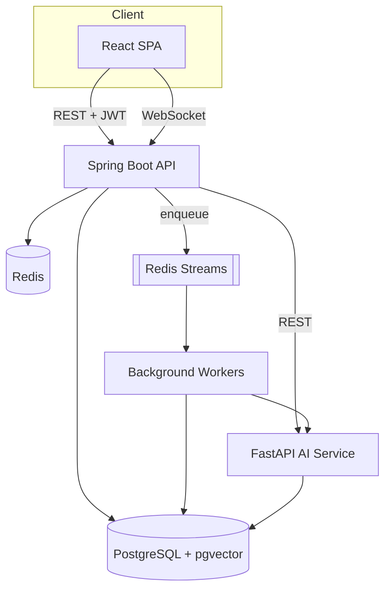

# AI-Powered Multi-Tenant Helpdesk SaaS

A multi-tenant helpdesk SaaS with AI-powered response assistance, semantic knowledge base search, and real-time collaboration.

## Architecture

The system is a modular monolith with a separate AI service:

- **Spring Boot API**: Core business logic, authentication, ticket management, multi-tenancy
- **FastAPI AI Service**: LLM integration, document processing, embeddings, RAG pipeline
- **React + TypeScript Frontend**: Single-page application with real-time updates
- **PostgreSQL + pgvector**: Relational database with vector similarity search
- **Redis**: Job queue (Streams), rate limiting, WebSocket session management


```mermaid
flowchart TB
    subgraph Client
        FE[React SPA]
    end

    FE -->|REST + JWT| API[Spring Boot API]
    FE -->|WebSocket| API

    API -->|REST| AI[FastAPI AI Service]
    API --> PG[(PostgreSQL + pgvector)]
    API --> REDIS[(Redis)]

    API -->|enqueue| QUEUE[[Redis Streams]]
    QUEUE --> WORKER[Background Workers]
    WORKER --> AI
    WORKER --> PG

    AI --> PG
```

## Key Features

### Implemented

**Authentication & Multi-Tenancy**
- Email/password authentication with JWT
- Role-based access control (OWNER, ADMIN, AGENT, CUSTOMER)
- Organization membership system
- PostgreSQL Row-Level Security (RLS) for tenant isolation
- Tenant context propagation for all database operations

**Ticket Management**
- Full CRUD operations for tickets and messages
- Cursor-based pagination for efficient large-scale listing
- Internal notes (agent-only visibility)
- Agent assignment and priority/status management
- Real-time updates via WebSocket (ticket.created, ticket.updated, message.created)

**AI-Powered Response Assistant**
- RAG-based response suggestions with citations
- Streaming response generation via Server-Sent Events
- Similarity threshold filtering to exclude irrelevant context
- Prompt injection protection (untrusted data marking)
- Human approval workflow before sending AI-generated responses

**Knowledge Base**
- Document upload (PDF, text files)
- Automatic text extraction and chunking
- Embedding generation with local model (BAAI/bge-small-en-v1.5)
- pgvector storage with HNSW index for similarity search
- Document status tracking (PROCESSING, READY, FAILED)
- Semantic search with organization-scoped filtering

**Async AI Processing**
- Redis Streams for job queuing
- Async ticket classification (category, priority, sentiment)
- Async ticket summarization for long threads
- Consumer groups with retry logic and dead-letter queues
- SLA breach monitoring scheduler

**SLA Management**
- Configurable SLA policies per priority level
- First response and resolution deadline tracking
- SLA breach detection and monitoring
- Dashboard with SLA risk indicators

**Analytics**
- Ticket volume and resolution time metrics
- Agent workload tracking
- AI-generated insights for trend analysis
- Time-series data for dashboard visualization

**Rate Limiting**
- Redis-based rate limiting
- Per-IP limits on auth endpoints
- Per-user limits on AI endpoints
- Configurable windows and thresholds

## Technology Stack

**Backend**
- Java 21, Spring Boot 3
- Spring Security, Spring Data JPA
- PostgreSQL 16 with pgvector extension
- Redis 7
- Flyway migrations

**AI Service**
- Python 3.12, FastAPI
- HuggingFace Transformers (local embeddings)
- Google Gemini API (LLM provider)
- Custom chunking and document extraction

**Frontend**
- React 18, TypeScript
- Vite
- React Query (TanStack Query)
- React Router
- Lucide React icons

**Infrastructure**
- Docker Compose for local development
- Local filesystem storage (documents)
- No cloud deployment configured

## Project Structure

```
ai-helpdesk-saas/
├── backend/                 # Spring Boot API
│   ├── src/main/java/com/helpdesk/
│   │   ├── auth/           # Authentication, JWT, RBAC
│   │   ├── tickets/        # Ticket management
│   │   ├── kb/             # Knowledge base & RAG
│   │   ├── ai/             # AI service client
│   │   ├── redis/          # Async job processing
│   │   ├── sla/            # SLA policies & monitoring
│   │   ├── analytics/      # Analytics & insights
│   │   ├── websocket/      # Real-time updates
│   │   ├── orgs/           # Multi-tenancy context
│   │   ├── storage/        # Local document storage
│   │   └── config/         # Spring configuration
│   └── src/main/resources/
│       └── db/migration/   # Flyway migrations
├── ai-service/             # FastAPI AI Service
│   ├── app/
│   │   ├── llm/           # LLM provider abstraction
│   │   ├── services/      # RAG, classification, summarization
│   │   └── models/        # Pydantic models
│   └── tests/             # Unit tests
├── frontend/               # React SPA
│   ├── src/
│   │   ├── pages/         # Route components
│   │   ├── features/      # Feature modules
│   │   ├── api/           # API clients
│   │   └── components/    # UI components
└── docker-compose.yml      # Local development
```

## Local Setup

### Prerequisites
- Docker and Docker Compose
- Java 21 (for local backend development)
- Node.js 20+ (for local frontend development)
- Python 3.12 (for local AI service development)

### Environment Variables

Create a `.env` file in the repository root:

```bash
# Database
POSTGRES_PASSWORD=your_secure_password
APP_DB_PASSWORD=your_app_password

# JWT
APP_JWT_SECRET=your_jwt_secret_key

# CORS
APP_CORS_ALLOWED_ORIGIN=http://localhost:5173

# AI Service
LLM_PROVIDER=gemini
LLM_MODEL=gemini-1.5-flash
LLM_FALLBACK_MODEL=gemini-1.5-flash
GEMINI_API_KEY=your_gemini_api_key
```

### Running the Application

1. Start all services:
```bash
docker compose up -d
```

2. Wait for services to be healthy (Postgres and Redis have healthchecks)

3. Access the application:
- Frontend: http://localhost:5173
- Backend API: http://localhost:8080
- AI Service: http://localhost:8000
- API Health: http://localhost:8080/actuator/health

### Local Development

**Backend (Spring Boot)**
```bash
cd backend
./mvnw spring-boot:run
```

**Frontend (React)**
```bash
cd frontend
npm install
npm run dev
```

**AI Service (FastAPI)**
```bash
cd ai-service
python -m venv .venv
source .venv/bin/activate
pip install -r requirements.txt
uvicorn app.main:app --reload
```

## Database Schema

Key tables:
- `organizations`, `users`, `memberships` - Multi-tenancy and auth
- `tickets`, `ticket_messages`, `ticket_attachments` - Ticket data
- `knowledge_base_documents`, `kb_chunks` - Knowledge base with embeddings
- `ai_classifications`, `ai_generations` - AI outputs
- `sla_policies` - SLA configuration
- `notifications` - In-app notifications
- `audit_logs` - System audit trail

Tenant isolation: All tenant-scoped tables have `organization_id` as the leading column in indexes. RLS policies enforce tenant isolation at the database layer.

Vector search: `kb_chunks` uses pgvector with HNSW index for similarity search. Organization filtering happens before vector search to prevent cross-tenant data leakage.

## API Endpoints

**Authentication**
- `POST /api/auth/register` - User registration
- `POST /api/auth/login` - User login
- `POST /api/auth/websocket-ticket` - WebSocket authentication

**Tickets**
- `GET /api/orgs/{orgId}/tickets` - List tickets (cursor pagination)
- `POST /api/orgs/{orgId}/tickets` - Create ticket
- `GET /api/orgs/{orgId}/tickets/{id}` - Get ticket details
- `PATCH /api/orgs/{orgId}/tickets/{id}` - Update ticket
- `POST /api/orgs/{orgId}/tickets/{id}/messages` - Add message
- `GET /api/orgs/{orgId}/tickets/{id}/messages` - List messages

**AI Response Assistant**
- `POST /api/orgs/{orgId}/tickets/{id}/ai/suggest-response` - Generate response
- `POST /api/orgs/{orgId}/tickets/{id}/ai/stream-response` - Stream response (SSE)
- `POST /api/orgs/{orgId}/tickets/{id}/ai/approve-response` - Approve and send

**Knowledge Base**
- `POST /api/orgs/{orgId}/kb/documents` - Upload document
- `GET /api/orgs/{orgId}/kb/documents` - List documents
- `GET /api/orgs/{orgId}/kb/search` - Semantic search
- `POST /api/orgs/{orgId}/kb/rag` - RAG query

**SLA Policies**
- `GET /api/orgs/{orgId}/sla-policies` - List policies
- `POST /api/orgs/{orgId}/sla-policies` - Create policy
- `PUT /api/orgs/{orgId}/sla-policies/{id}` - Update policy
- `DELETE /api/orgs/{orgId}/sla-policies/{id}` - Delete policy

**Analytics**
- `GET /api/orgs/{orgId}/analytics` - Overview metrics
- `POST /api/orgs/{orgId}/analytics/ai-insight` - Generate AI insight

## Testing

**Backend**
```bash
cd backend
./mvnw test
```

Key test coverage:
- Response assistant service (RAG pipeline, similarity filtering, role checks)
- Tenant transaction executor (RLS context propagation)
- Redis Stream consumers (classification, summarization)
- Knowledge base vector repository

**AI Service**
```bash
cd ai-service
pytest
```

Test coverage:
- Text chunking algorithms
- Document extraction
- Embedding generation
- API endpoints

## Technical Decisions

**Modular Monolith vs Microservices**
Chose a modular monolith with a separate AI service. This reduces operational complexity while still demonstrating polyglot architecture and inter-service communication. The AI service is separated because it has different scaling characteristics (I/O-bound external API calls) and uses a different technology stack.

**PostgreSQL + pgvector**
Avoided a separate vector database for MVP scale. pgvector provides sufficient performance for the expected data volume. The tenant filter is applied in the SQL WHERE clause before the vector search to prevent cross-tenant data leakage.

**Redis Streams for Job Queue**
Redis Streams provide sufficient queuing capabilities for this scale without the operational overhead of RabbitMQ or Kafka. Consumer groups enable parallel processing with automatic message distribution and dead-letter queue handling.

**Synchronous vs Asynchronous AI Operations**
- Synchronous: Response assistant (user is waiting for the result)
- Asynchronous: Ticket classification and summarization (background processing)
This distinction keeps the request path fast for user-facing operations while enabling heavy processing in the background.

**Cursor-based Pagination**
Tickets use cursor-based pagination on `(created_at, id)` for efficient large-scale listing. This avoids the performance degradation of offset pagination at scale.

**Prompt Injection Protection**
The AI service uses explicit "untrusted data" delimiters and instructs the LLM to treat all retrieved content as data, not instructions. This is a defense-in-depth approach against prompt injection from malicious knowledge base documents or customer messages.

## Current Implementation Status

**Fully Functional**
- Authentication and authorization
- Multi-tenant data isolation with RLS
- Ticket CRUD and real-time updates
- Knowledge base upload and semantic search
- AI response assistant with streaming
- Async ticket classification and summarization
- SLA policy management and tracking
- Analytics dashboard
- Rate limiting
- Local development environment (Docker Compose)

**Partially Implemented**
- File storage: Uses local filesystem instead of S3 (no presigned URLs, no malware scanning)
- SLA breach monitoring: Scheduler exists but execution not verified
- Email: No email service integration (no verification emails, no password reset)

**Not Implemented**
- S3 object storage
- Email notifications
- OAuth login (Google, etc.)
- Malware/virus scanning
- AWS/cloud deployment infrastructure
- CI/CD pipeline
- Frontend tests
- E2E tests
- Audit log UI
- Tagging system UI
- Customer portal (separate from agent dashboard)

## Roadmap

**Near-term**
- Add frontend tests (React Testing Library)
- Implement S3 storage for documents
- Add email notification service
- Verify and test SLA breach scheduler execution

**Medium-term**
- Add customer portal (separate from agent dashboard)
- Implement audit log UI
- Add tagging system UI
- Set up CI/CD pipeline

**Long-term**
- AWS deployment with Terraform
- Dedicated vector database migration (if needed)
- OAuth login providers
- E2E test suite with Playwright
