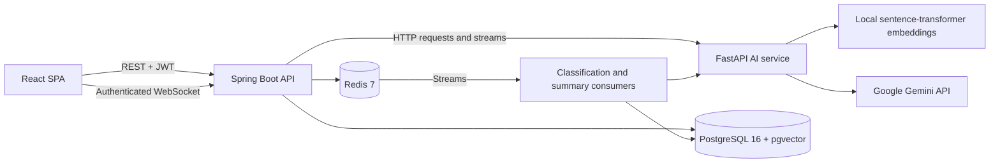

# AI Helpdesk SaaS

A multi-tenant support desk with ticket workflows, a document-backed knowledge base, and AI assistance. A Spring Boot backend owns application state and tenant access, while a separate FastAPI service handles embeddings and LLM requests.

Tenant data is isolated by both API-level organization checks and PostgreSQL row-level security (RLS). AI work is split by latency: requests a user waits on run synchronously through the backend, while classification and summarization run in the background on Redis Streams. The project runs locally with Docker Compose; there is no cloud deployment.

## Key Features

### Helpdesk
- Organization-scoped ticket creation, filtering, updates, messages, internal notes, and assignment
- Cursor pagination over `(created_at, id)`
- Organization WebSocket events and in-app notifications

### Multi-Tenancy & Security
- Email/password registration and login with BCrypt hashing
- Short-lived stateless JWTs and organization roles: `OWNER`, `ADMIN`, `AGENT`, `CUSTOMER`
- Organization membership checks at the request boundary
- Transaction-local tenant context with forced RLS policies on tenant-owned tables

### Knowledge Base & AI
- Document upload with text extraction from PDF, DOCX, TXT, and Markdown
- Paragraph-aware chunking and 384-dimensional embeddings
- Organization-filtered pgvector cosine search
- RAG answers with source-chunk citations
- Ticket response suggestions streamed over SSE, with an approval-before-send endpoint

### Async Processing
- Redis Stream workers for ticket classification (on creation) and ticket summarization (after public messages)
- Acknowledgement of successful jobs, retries, stale pending-message recovery, and dead-letter streams for exhausted jobs

### Operations
- Priority-based first-response and resolution targets, with a one-minute breach checker
- Notifications to assigned agents
- Date-filtered support analytics and persisted AI-generated insights
- Redis-backed rate limits on selected auth, AI, and search routes

### Frontend
A React SPA with login/register, dashboard, ticket list/detail, knowledge base, SLA policy, analytics, organization member, and settings views. It uses React Query for server state and connects to the backend over REST and WebSocket.

## Architecture


```mermaid
flowchart LR
    Browser[React SPA] -->|REST + JWT| API[Spring Boot API]
    Browser -->|Authenticated WebSocket| API
    API -->|HTTP requests and streams| AI[FastAPI AI service]
    API --> DB[(PostgreSQL 16 + pgvector)]
    API --> Redis[(Redis 7)]
    Redis -->|Streams| Workers[Classification and summary consumers]
    Workers --> AI
    Workers --> DB
    AI --> Embed[Local sentence-transformer embeddings]
    AI --> Gemini[Google Gemini API]
```

The browser talks only to the Spring Boot API, which owns all application data in PostgreSQL and calls the FastAPI service whenever it needs embeddings or LLM output. The AI service never connects to the application database.

Ticket workflows, document processing, semantic search, analytics, and response suggestions are initiated synchronously through the backend. Classification and summaries don't need to block the user request, so they are queued on Redis Streams and processed by backend consumers.

## Engineering Decisions

- **Modular backend + separate AI service.** Application logic and tenant access live in one modular Spring application. The embedding and LLM workload sits behind an HTTP boundary in Python, with no direct database access.
- **PostgreSQL + pgvector.** PostgreSQL is the source of truth for both application data and vectors, so similarity search (cosine distance, HNSW index) applies the same organization filtering as the rest of the data.
- **RLS as a second isolation layer.** Membership is checked at the request boundary, and a transaction listener sets `app.current_org_id` transaction-locally for the database policies. The app database role is created without `BYPASSRLS`.
- **Synchronous vs. asynchronous AI work.** User-initiated actions (search, RAG, response suggestions) go through the backend directly, and suggestions can stream over SSE. Work nobody is waiting on is queued.
- **Redis Streams for background jobs.** Consumers acknowledge successful jobs, retry failures, recover stale pending messages, and move exhausted jobs to dead-letter streams.
- **Cursor-based pagination.** Cursors encode sort order, timestamp, and a UUID tie-breaker, and the frontend consumes pages through an infinite query.
- **Local embeddings.** Embeddings are generated locally with `BAAI/bge-small-en-v1.5` (Sentence Transformers). Only LLM requests go to Gemini.
- **Untrusted content in prompts.** The response-assistant prompt treats ticket and knowledge-base content as untrusted input. This is prompt guidance only, not an enforced guarantee against prompt injection.
- **Known trade-off.** Document extraction and per-chunk embedding currently run inline in the upload transaction (see [Roadmap](#roadmap)).

## Technology Stack

| Area | Versions and components |
| --- | --- |
| Backend | Java 21, Spring Boot 4.1.1, Spring Security, Spring Data JPA, Flyway |
| Database and queue | PostgreSQL 16 (`pgvector/pgvector:pg16`), Redis 7 (`redis:7-alpine`) |
| AI service | Python 3.12, FastAPI and Uvicorn (not version-pinned in `requirements.txt`), Sentence Transformers, Google GenAI SDK |
| Embeddings and LLM | `BAAI/bge-small-en-v1.5` (384 dimensions), Gemini provider implementation |
| Frontend | React 19.2.8, TypeScript 6.0.2, Vite 8.3.0, TanStack Query, React Router 7 |
| Local infrastructure | Docker Compose; local filesystem document storage |

Python dependencies are unpinned. Frontend dependencies use the ranges recorded in `frontend/package.json`.

## Project Structure

```text
backend/                        Spring Boot API, services, migrations, JUnit tests
ai-service/                     FastAPI app, LLM providers, extraction, embeddings, pytest tests
frontend/                       React SPA, routes, pages, API clients
infrastructure/postgres/init/   PostgreSQL application-role initialization
docker-compose.yml              PostgreSQL, Redis, backend, AI service
```

## Local Setup

**Prerequisites:** Docker Compose, Java 21, Node.js/npm, and Python 3.12 (only if running the AI service outside Docker).

1. **Configure the environment.** Copy the example file, then set the database passwords, `APP_JWT_SECRET`, `LLM_PROVIDER=gemini`, `LLM_FALLBACK_MODEL`, and `GEMINI_API_KEY`. The AI service requires the Gemini settings at startup.

```bash
   cp .env.example .env
```

   To seed demo data for development/testing, also set `APP_SEED_DEMO_DATA=true`. This is idempotent and will not create duplicates on subsequent runs.

   Compose passes `LLM_FALLBACK_MODEL` to the AI service as both `LLM_MODEL` and its fallback model.

2. **Build the backend JAR, then start the services.** The backend Dockerfile copies the prebuilt artifact, so the JAR must exist before the image is built.

```bash
   cd backend
   ./mvnw -DskipTests package
   cd ..
   docker compose up --build
```

   Compose starts PostgreSQL (`5432`), Redis (`6379`), the backend (`8080`), and the AI service (`8000`). PostgreSQL and Redis have health checks, and the backend depends on both. Compose does **not** start the frontend.

3. **Start the frontend** in another terminal:

```bash
   cd frontend
   npm ci
   npm run dev
```

   Vite serves the app at `http://localhost:5173`. It defaults to API `http://localhost:8080` and WebSocket `ws://localhost:8080`; override these with `VITE_API_BASE_URL` and `VITE_WS_BASE_URL`.

**Document storage:** uploaded knowledge-base files are stored on the backend's local filesystem, mounted by Compose at `backend/local-storage`. There is no S3 integration.

### Running services directly

- **Backend:** from `backend/`, run `./mvnw spring-boot:run` once PostgreSQL, Redis, credentials, and the AI service are configured. Local defaults expect PostgreSQL at `localhost:5432`, Redis at `localhost:6379`, and the AI service at `http://ai-service:8000`. When running on the host, set `APP_AI_SERVICE_URL=http://localhost:8000`.
- **AI service:** from `ai-service/`, install `requirements.txt` into a Python 3.12 environment, set `LLM_PROVIDER` and `GEMINI_API_KEY`, then run:

```bash
  uvicorn app.main:app --reload --port 8000
```

## Demo Data Seeding

For development and demo purposes, the application includes an idempotent demo data seeder that creates realistic test data.

**To enable demo data seeding:**

Set `APP_SEED_DEMO_DATA=true` in your `.env` file or pass it to docker-compose:

```bash
APP_SEED_DEMO_DATA=true docker compose up --build
```

**What gets created:**

- 1 demo organization (slug: `demo-org`)
- 7 demo users across all roles:
  - 1 Owner (alice@demo.local)
  - 1 Admin (bob@demo.local)
  - 2 Agents (carol@demo.local, david@demo.local)
  - 3 Customers (emma@demo.local, frank@demo.local, grace@demo.local)
- 11 realistic support tickets with multi-message conversations
- 4 knowledge base documents with embeddings
- Simulated AI classifications and summaries on some tickets

**Demo login credentials:**

All demo users use password `Demo[Role]123!` (e.g., `DemoOwner123!`, `DemoAgent123!`).

**Idempotency:**

The seeder checks for the existence of the demo organization by slug. If it already exists, seeding is skipped. Running multiple times will not create duplicates.

**Production safety:**

The seeder is gated behind `@ConditionalOnProperty(name = "app.seed-demo-data", havingValue = "true")` and defaults to `false`. It cannot run accidentally in production unless explicitly enabled.

## Configuration

`.env.example` lists the Compose-facing variables.

| Variable | Used by | Purpose |
| --- | --- | --- |
| `POSTGRES_PASSWORD` | Compose/PostgreSQL | Database administrator and Flyway password |
| `APP_DB_PASSWORD` | Compose/PostgreSQL | Password for the restricted `helpdesk_app` role |
| `APP_JWT_SECRET` | Backend | JWT signing secret |
| `APP_CORS_ALLOWED_ORIGIN` | Backend | Allowed browser origin (default `http://localhost:5173`) |
| `APP_REFRESH_TOKEN_EXPIRATION_MS` | Backend | Refresh token lifetime in milliseconds (default 30 days) |
| `APP_REFRESH_COOKIE_SECURE` | Backend | Require HTTPS for the refresh cookie (set `true` in production) |
| `APP_REFRESH_COOKIE_SAME_SITE` | Backend | Refresh cookie SameSite setting (default `Lax`; use `None` with `Secure=true` for cross-site frontend/API deployments) |
| `APP_SEED_DEMO_DATA` | Backend | Enable demo data seeding on startup (development only, default `false`) |
| `LLM_PROVIDER` | AI service | LLM provider; currently only `gemini` |
| `LLM_MODEL` | AI service | Primary model for a directly run AI process; Compose sets it from `LLM_FALLBACK_MODEL` |
| `LLM_FALLBACK_MODEL` | AI service/Compose | Gemini fallback model; also used as Compose's primary model |
| `GEMINI_API_KEY` | AI service | Gemini API credential |
| `EMBEDDING_DEVICE` | AI service | Sentence Transformers device (default `cpu`) |

## Testing

Run each command from the repository root, in its own terminal:

```bash
(cd backend && ./mvnw test)          # JUnit
(cd ai-service && python -m pytest)  # pytest
(cd frontend && npm run build)       # build check only
```

| Suite | Covers | Requires |
| --- | --- | --- |
| Backend (JUnit) | Service rules, response-assistant request construction and persistence, tenant context behavior, Redis producers/consumers, SLA policy behavior, analytics, local storage, vector repository integration | PostgreSQL and Redis running, with matching datasource/Flyway credentials |
| AI service (pytest) | Chunking, extraction, embedding dimensions, embeddings endpoint | A configured Gemini provider and API key, because `app.main` constructs the provider at import time |

**Not covered**
- LLM workflows in the AI service
- Frontend: there are no test scripts or test files, so `npm run build` is the only check
- End-to-end flows: there are no end-to-end tests

## Current Status

### Implemented
- Backend ticket workflows and cursor pagination
- JWT authentication and organization role handling
- Tenant isolation with RLS
- Knowledge-base upload, search, and RAG
- Response assistant: suggestion, SSE stream, and approval endpoint
- Redis classification and summary workers
- SLA policies and breach processing
- Analytics
- SPA views for tickets, knowledge base, SLA policies, analytics, members, and settings

### Partial / Not End-to-End
- **Attachments and audit log:** database tables exist (including an `s3_key` column), but there is no application workflow for either. These are schema elements only.
- **Classifications and summaries:** stored by the backend, with limited UI evidence for displaying them.
- **WebSocket events:** sessions are held in process memory, and the browser handles only selected event types.
- **Document storage:** local filesystem only, not an object-storage service.
- **AI operations:** some exist only as AI-service endpoints and are not exposed as frontend actions.
- **Prompt-injection handling:** explicit in the response-assistant prompt, but not independently enforced or covered by adversarial tests.

### Not Implemented
- Cloud/Terraform deployment
- GitHub Actions workflows
- Email delivery
- OAuth
- Malware scanning
- Frontend and end-to-end test suites

## Roadmap

- Add integration tests against PostgreSQL and Redis, plus LLM-service tests that don't require live credentials.
- Move document extraction and embedding out of the upload request, and add durable object storage if required.
- Complete the attachment and audit-log workflows, or remove the unused schema.
- Add frontend and end-to-end tests, and document a deployment target only once the infrastructure exists.
