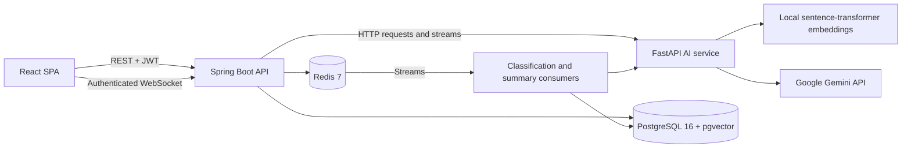

# AI Helpdesk SaaS

A multi-tenant support desk with ticket workflows, a document-backed knowledge base, and AI assistance. The Java backend owns application state and tenant access; a separate Python service handles embeddings and LLM requests.

## Architecture


```mermaid
flowchart LR
    Browser[React SPA] -->|REST + JWT| API[Spring Boot API]
    Browser -->|Authenticated WebSocket| API
    API -->|HTTP requests and streams| AI[FastAPI AI service]
    API --> DB[(PostgreSQL 16 + pgvector)]
    API --> Redis[(Redis 7)]
    Redis -->|Streams| Workers[Classification and summary consumers]
    Workers --> AI
    Workers --> DB
    AI --> Embed[Local sentence-transformer embeddings]
    AI --> Gemini[Google Gemini API]
```

Ticket workflows, knowledge-base document processing, semantic search, analytics, and response suggestions are initiated synchronously through the backend. Ticket classification and conversation summaries are queued on Redis Streams and processed by backend consumers. Response suggestions can stream to the browser over SSE. The AI service does not connect directly to the application database.

## Implemented Features

- Email/password registration and login with BCrypt password hashing, short-lived stateless JWTs, and organization roles (`OWNER`, `ADMIN`, `AGENT`, `CUSTOMER`).
- Organization-scoped ticket creation, filtering, updates, messages, internal notes, assignment, and cursor pagination over `(created_at, id)`.
- Organization membership checks plus PostgreSQL transaction-local tenant context and forced RLS policies on tenant-owned tables.
- Knowledge-base upload, local filesystem storage, extraction from PDF, DOCX, TXT, and Markdown, paragraph-aware chunking, 384-dimensional embeddings, and organization-filtered pgvector cosine search.
- RAG answers with source-chunk citations, and ticket response suggestions with streamed output and an approval-before-send endpoint. The response-assistant prompt treats ticket and knowledge-base content as untrusted input; this is prompt guidance, not a guarantee against prompt injection.
- Redis Stream workers for ticket classification on creation and ticket summarization after public messages. Workers acknowledge successful jobs, retry failures, recover stale pending messages, and move exhausted jobs to dead-letter streams.
- Priority-based first-response and resolution targets, a one-minute breach checker, and notifications to assigned agents.
- Date-filtered support analytics, persisted AI-generated insights, Redis-backed rate limits on selected auth/AI/search routes, organization WebSocket events, and in-app notifications.

The frontend contains login/register, dashboard, ticket list/detail, knowledge-base, SLA policy, analytics, organization member, and settings views. It uses React Query for server state and connects to the backend REST and WebSocket APIs.

## Technology

| Area | Versions and components |
| --- | --- |
| Backend | Java 21, Spring Boot 4.1.1, Spring Security, Spring Data JPA, Flyway |
| Database and queue | PostgreSQL 16 (`pgvector/pgvector:pg16`), Redis 7 (`redis:7-alpine`) |
| AI service | Python 3.12, FastAPI and Uvicorn (not version-pinned in `requirements.txt`), Sentence Transformers, Google GenAI SDK |
| Embeddings and LLM | `BAAI/bge-small-en-v1.5` (384 dimensions), Gemini provider implementation |
| Frontend | React 19.2.8, TypeScript 6.0.2, Vite 8.3.0, TanStack Query, React Router 7 |
| Local infrastructure | Docker Compose; local filesystem document storage |

Python dependencies are listed without version pins. Frontend dependencies use the ranges recorded in `frontend/package.json`.

## Engineering Notes

- The backend is organized as a modular Spring application, with the AI workload isolated behind an HTTP service boundary.
- PostgreSQL is the source of truth for application data and vectors. Migration V2 changes the embedding column and HNSW index to 384 dimensions; vector search uses cosine distance and organization filtering.
- The app database role is created without `BYPASSRLS`. Organization membership is checked at the request boundary; a transaction listener sets `app.current_org_id` transaction-locally for database policies.
- Redis Streams handle classification and summaries that do not need to block the user request. Upload extraction and per-chunk embedding currently happen inline in the upload transaction.
- Ticket cursors encode the sort order, timestamp, and UUID tie-breaker. The frontend consumes pages through an infinite query.
- WebSocket session subscriptions are held in process memory. The backend emits ticket and message events; the browser invalidates ticket/message queries and notification queries for supported event types.

## Project Structure

```text
backend/       Spring Boot API, services, migrations, and JUnit tests
ai-service/    FastAPI app, LLM providers, extraction, embeddings, and pytest tests
frontend/      React SPA, routes, pages, and API clients
infrastructure/postgres/init/  PostgreSQL application-role initialization
docker-compose.yml             PostgreSQL, Redis, backend, and AI service
```

## Local Setup

Prerequisites: Docker Compose, Java 21, Node.js/npm, and Python 3.12 if running the AI service outside Docker.

1. Copy `.env.example` to `.env` and set database passwords, `APP_JWT_SECRET`, `LLM_PROVIDER=gemini`, `LLM_FALLBACK_MODEL`, and `GEMINI_API_KEY`:

   ```bash
   cp .env.example .env
   ```

   The Compose file passes `LLM_FALLBACK_MODEL` as the AI service's `LLM_MODEL` as well as its fallback model.
2. Build the backend JAR before building its image; the backend Dockerfile copies this prebuilt artifact:

   ```bash
   cd backend
   ./mvnw -DskipTests package
   cd ..
   docker compose up --build
   ```

Compose starts PostgreSQL on `5432`, Redis on `6379`, the backend on `8080`, and the AI service on `8000`. It does not start the frontend. PostgreSQL and Redis have health checks; the backend depends on both. The AI service requires the Gemini settings above during startup.

3. In another terminal, start the SPA:

   ```bash
   cd frontend
   npm ci
   npm run dev
   ```

Vite serves the app at `http://localhost:5173`. The frontend defaults to API `http://localhost:8080` and WebSocket `ws://localhost:8080`; `VITE_API_BASE_URL` and `VITE_WS_BASE_URL` can override those defaults.

Uploaded knowledge-base files are stored on the backend's local filesystem, mounted by Compose at `backend/local-storage`. No S3 integration is configured.

## Configuration

| Variable | Used by | Purpose |
| --- | --- | --- |
| `POSTGRES_PASSWORD` | Compose/PostgreSQL | Database administrator and Flyway password |
| `APP_DB_PASSWORD` | Compose/PostgreSQL | Password for the restricted `helpdesk_app` role |
| `APP_JWT_SECRET` | Backend | Signs JWTs |
| `APP_CORS_ALLOWED_ORIGIN` | Backend | Allowed browser origin; defaults to `http://localhost:5173` |
| `LLM_PROVIDER` | AI service | Currently supported value: `gemini` |
| `LLM_MODEL` | AI service | Primary model for a directly configured AI process; Compose sets it from `LLM_FALLBACK_MODEL` |
| `LLM_FALLBACK_MODEL` | AI service/Compose | Gemini fallback model; also passed as Compose's primary model |
| `GEMINI_API_KEY` | AI service | Gemini API credential |
| `EMBEDDING_DEVICE` | AI service | Sentence Transformers device; defaults to `cpu` |

`.env.example` lists the Compose-facing variables. The backend's local defaults expect PostgreSQL at `localhost:5432`, Redis at `localhost:6379`, and the AI service at `http://ai-service:8000`; when running the backend directly on the host, override `APP_AI_SERVICE_URL` to `http://localhost:8000`.

## Running Services Directly

The backend can be run from `backend/` with `./mvnw spring-boot:run` once PostgreSQL, Redis, credentials, and the AI service are configured. The AI service can be run from `ai-service/` after installing `requirements.txt` into a Python 3.12 environment, setting `LLM_PROVIDER` and `GEMINI_API_KEY`, and running `uvicorn app.main:app --reload --port 8000`.

## Testing

Run each command from the repository root in its own terminal:

```bash
cd backend && ./mvnw test
```

The backend tests require PostgreSQL and Redis to be available, along with matching datasource/Flyway credentials. The vector repository and application-context tests need PostgreSQL; the app also connects to Redis during startup.

```bash
cd ai-service && python -m pytest
```

```bash
cd frontend && npm run build
```

Backend tests cover service rules, response-assistant request construction and persistence, tenant context behavior, Redis producers/consumers, SLA policy behavior, analytics, local storage, and vector repository integration. AI tests assert chunking, extraction, embedding dimensions, and the embeddings endpoint; they do not test the LLM workflows. Because `app.main` constructs the Gemini provider at import time, AI test imports also require a configured Gemini provider and API key. There are no frontend test scripts or test files in the package.

## Current Status

**Implemented:** backend ticket workflows and cursor pagination; JWT and organization role handling; tenant RLS; knowledge-base upload/search/RAG; response-assistant suggestion, SSE stream, and approval endpoint; Redis classification and summary workers; SLA policy and breach processing; analytics; SPA views for tickets, KB, SLA policies, analytics, members, and settings.

**Partial or not exposed end to end:** ticket attachment and audit-log tables exist, but there is no corresponding application workflow; summaries and classifications are stored by the backend, with limited UI evidence for displaying them; WebSocket sessions are process-local and the browser handles only selected event types; local file storage is not an object-storage service; some AI operations exist only as AI-service endpoints and are not exposed as frontend actions. Prompt-injection handling is explicit in the response-assistant prompt but is not independently enforced or covered by adversarial tests.

**Not present in this repository:** cloud/Terraform deployment, GitHub Actions workflows, email delivery, OAuth, malware scanning, and frontend or end-to-end test suites. The audit-log table, attachment table, and `s3_key` column are schema elements, not evidence that those features are implemented.

## Roadmap

Potential next steps based on the current gaps:

- Add integration tests that run against PostgreSQL and Redis, and LLM-service tests that do not require live credentials.
- Move document extraction and embedding out of the upload request and add durable object storage if required.
- Complete attachment and audit-log application workflows, or remove unused schema when no longer needed.
- Add frontend and end-to-end tests; document a deployment target only after infrastructure is implemented.